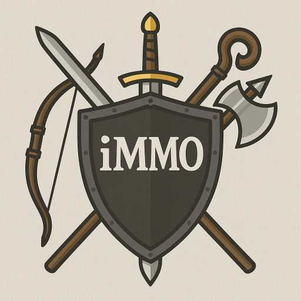
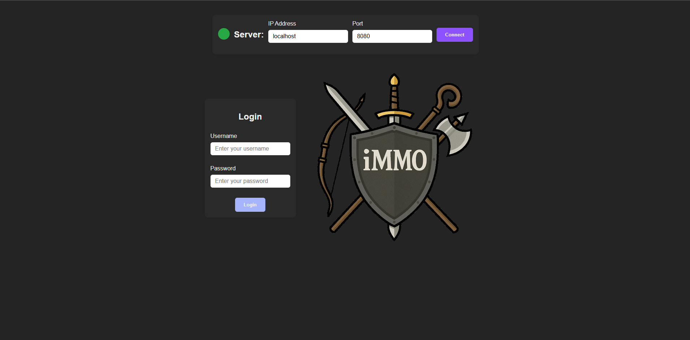
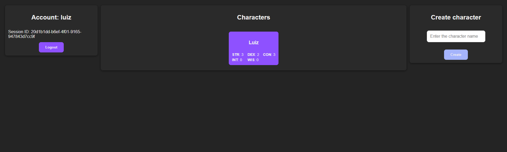
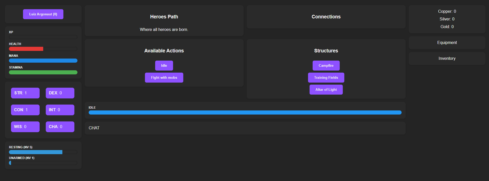

# 🛡️🧙 iMMO — Idle-mmorpg

<p align="center">
  
</p>

# 💡 Motivation
I got tired of playing idle MMORPGs that are abandoned by developers, filled with aggressive monetization, and lacking meaningful updates or player interaction.
iMMO was born from the desire to build something better: a idle-friendly game with constant progression, active community features, and no paywalls — focused on fun, accessibility, and long-term evolution.

# 👥 People
This project was envisioned, created, and is maintained by:  
- **[Luiz Antonio Nicolau Anghinoni](https://github.com/luizantoniona)**

# 🎯 Project Goals
- ⚔️ Create a accessible idle MMORPG experience  
- 🌐 Build a scalable multiplayer backend in **C++**  
- 💬 Offer real-time interaction via **WebSocket** and web interface  

# 📦 Project Organization:

## ⚙️ [`idle-mmorpg-data`](https://github.com/luizantoniona/idle-mmorpg/tree/main/idle-mmorpg-data)
- **Data Project**
  - Tools and scripts to generate, validate, and maintain game content.
  - Outputs JSON files that are consumed by the server.
  - Easily expandable to support balancing, batch editing, or procedural generation.

### 🗡️ **idle-mmorpg-item**:  
Modular item data.  
This folder defines the items structure used by the game server.

### 🗺️ **idle-mmorpg-map**:  
Modular map data.  
This folder defines the world structure, continents, areas, enemies, NPCs, and navigation logic used by the game server.

### 🤺 **idle-mmorpg-skill**:  
Modular skills data.  
This folder defines all the skills in game.

### ⚙️ **utility**:  
Tools and scripts.  
This folder has the tools and scripts to visualize and generate the data information.

### 📖 **Documentation**:  
TODO

## 🛡️ [`idle-mmorpg-server`](https://github.com/luizantoniona/idle-mmorpg/tree/main/idle-mmorpg-server)
- **C++ Server**
  - Central game logic and state management.
  - Manages user sessions, world state, entities, and events.
  - Communicates with the client via API and WebSocket.
  - Loads static game data (items, maps, skills) at runtime from JSON files.

Base URL: http://localhost:8080

### 📖 **Documentation**:  
[`API`](https://github.com/luizantoniona/idle-mmorpg/tree/main/documentation/API.md) – API requests documentation.  
[`WebSocket`](https://github.com/luizantoniona/idle-mmorpg/tree/main/documentation/WebSocket.md) – WebSocket messages documentation.  

## ⚔️ [`idle-mmorpg-client`](https://github.com/luizantoniona/idle-mmorpg/tree/main/idle-mmorpg-client)
- **Web Client**
  - Responsible for rendering the game UI, receiving real-time updates via WebSocket, and sending player actions to the server.
  - Built with web tooling (Angular and Typescript).

### 📖 **Documentation**:  
TODO

### 🖼️ **Images**:  
Login Page:
<div align="left">
  
</div>

Account Page:
<p align="left">
  
</p>

Game Page:
<p align="lfet">
  
</p>

# 🚀 Running
These instructions will help you set up the project locally for development and testing.

### 📋 Prerequisites
Each part of the project has its own dependencies. Make sure you have the following tools installed:
- **CMake** (version 3.16 or higher)
- **C++** compiler compatible with C++20 (e.g. GCC, Clang, MSVC)
- **Node.js** (required for running the web client)
- **Python 3.x** (used for data generation and tooling)

### 🔧 Dependency management:
- The server uses **vcpkg** for C++ dependencies
- The client uses package.json (via **npm**)
- The data project uses **requirements.txt**

## 📁 Clone the Repository
```bash
git clone https://github.com/luizantoniona/idle-mmorpg.git
cd idle-mmorpg
```

## 🖥️ Running the Server (C++)
1 - Navigate to the server directory:
```bash
cd ./idle-mmorpg-server
```

TODO: Add server building process

## 🌐 Running the Client (Web)
1 - Navigate to the client folder:
```bash
cd ./idle-mmorpg-client
```

2 - Install dependencies:
```bash
npm install
```
Start the development server:
```bash
ng serve
```

## 🧾 Running the Data Tools (Python)
1 - Navigate to the data folder:
```bash
cd ./idle-mmorpg-data
```

2 - Install required Python packages:
```bash
pip install -r requirements.txt
```

3 - Run data scripts as needed. For example:
```bash
python3 ./utility/plot_map.py
```
