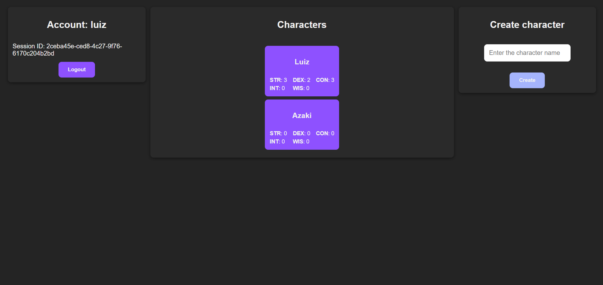
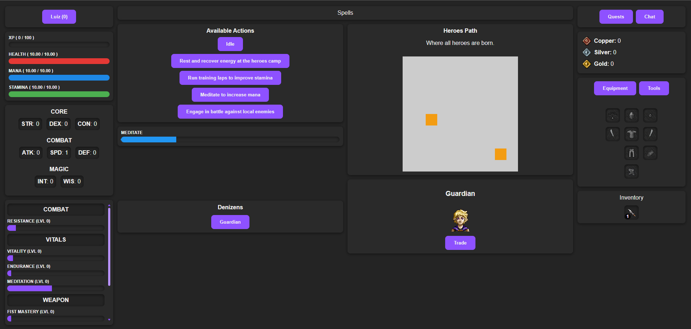
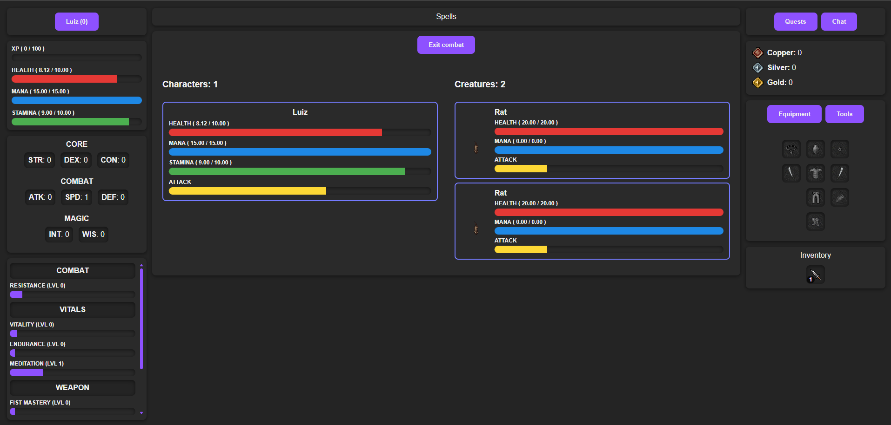

# 🛡️🧙 iMMO — Idle-MMORPG

<p align="center">
  
</p>

# 💡 Motivation
I got tired of playing idle MMORPGs that are abandoned by developers, filled with aggressive monetization, and lacking meaningful updates or player interaction.  
iMMO was born from the desire to build something better: a idle-friendly game with constant progression, active features, and no paywalls — focused on fun, accessibility, and long-term evolution.

# 👥 People
This project was envisioned, created, and is maintained by:  
- **[Luiz Antonio Nicolau Anghinoni](https://github.com/luizantoniona)**

# 🎯 Project Goals
- ⚔️ Create a accessible idle MMORPG experience  
- 🌐 Build a scalable multiplayer backend in **C++**  
- 💬 Offer real-time interaction via **WebSocket** and web interface  

# 📦 Project Organization:

## 🛡️ [`idle-mmorpg-server`](https://github.com/luizantoniona/idle-mmorpg/tree/main/idle-mmorpg-server)
- **C++ Server**
  - Central game logic and state management.
  - Manages user sessions, world state, entities, and events.
  - Communicates with the client via API and WebSocket.
  - Loads static game data (items, maps, skills) at runtime from JSON files.

### 📖 **Documentation**:  
[`API`](https://github.com/luizantoniona/idle-mmorpg/tree/main/documentation/API.md) – API requests documentation.  
[`WebSocket`](https://github.com/luizantoniona/idle-mmorpg/tree/main/documentation/WebSocket.md) – WebSocket messages documentation.  

### ⚙️ **Database**
- **For now, you need to run the schema manually.**
- **Once all tables are defined and only minor changes are needed, we will create the migration steps.**

## 🎨 [`idle-mmorpg-editor`](https://github.com/luizantoniona/idle-mmorpg/tree/main/idle-mmorpg-editor)
- **Data Editor**
  - TODO

## 🧩 [`idle-mmorpg-data`](https://github.com/luizantoniona/idle-mmorpg/tree/main/idle-mmorpg-data)
- **Data Project**
  - Game content.
  - Outputs JSON files that are consumed by the server.
  - Easily expandable to support balancing, batch editing, or procedural generation.
  - 🐾 **idle-mmorpg-creature**: Defines the structure and attributes of all creatures.
  - 👲 **idle-mmorpg-denizen**: Structure and attributes of all denizens.
  - 🗡️ **idle-mmorpg-item**: Defines the items structure.
  - 🗺️ **idle-mmorpg-map**: Defines the world structure, continents, areas, enemies, NPCs, and navigation logic.
  - 🤺 **idle-mmorpg-skill**: Defines all the skills in game.
  - 🔮 **idle-mmorpg-spell**: Defines all the magical spells available in the game.

## ⚔️ [`idle-mmorpg-client`](https://github.com/luizantoniona/idle-mmorpg/tree/main/idle-mmorpg-client)
- **Web Client**
  - Responsible for rendering the game UI, receiving real-time updates via WebSocket, and sending player actions to the server.
  - Built with **Angular** and **Typescript**.

### 🖼️ **Images**:  
Login Page:
<div align="left">
  
</div>

Account Page:
<p align="left">
  
</p>

Game Page:
<p align="left">
  
</p>

Combat:
<p align="left">
  
</p>

# 🚀 Running
These instructions will help you set up the project locally for development and testing.

### 📋 Prerequisites
Each part of the project has its own dependencies. Make sure you have the following tools installed:
- **CMake** (version 3.16 or higher)
- **C++** compiler compatible with C++20 (e.g. GCC, Clang, MSVC)
- **Node.js** (required for running the web client and build editor)

### 🔧 Dependency management:
- The server uses **vcpkg** for C++ dependencies
- The client and editor uses package.json (via **npm**)
- The data project uses **requirements.txt**

## 📁 Clone the Repository
```bash
git clone https://github.com/luizantoniona/idle-mmorpg.git
cd idle-mmorpg
```

## 🖥️ Running the Server (C++)
1 - Navigate to the server directory:
```bash
cd ./idle-mmorpg-server
```

TODO: Add server building process

## 💡 Running the Editor
1 - Navigate to the editor folder:
```bash
cd ./idle-mmorpg-editor
```

TODO: Add editor building process

## 🌐 Running the Client (Web)
1 - Navigate to the client folder:
```bash
cd ./idle-mmorpg-client
```

2 - Install dependencies:
```bash
npm install
```

3 - Start the development server:
```bash
ng serve
```
